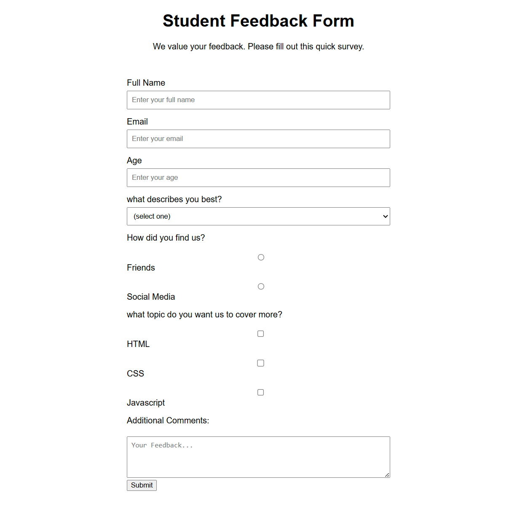

# Survey Form

This is a **Student Feedback Survey Form** built using HTML5 and CSS3 as part of the [freeCodeCamp Responsive Web Design Certification](https://www.freecodecamp.org/learn/). The form is designed to collect feedback from students about their learning experience and preferences.

## 📝 Features

- Responsive design layout
- User-friendly input fields
- Required form validation for name and email
- Age input with min and max constraints
- Dropdown selection for user type
- Radio buttons to collect referral source
- Checkboxes to understand topic preferences
- Textarea for additional feedback
- Styled using modern CSS

## 💡 Purpose

This project was created to practice and demonstrate skills in HTML and CSS. It also fulfills one of the certification project requirements in the **freeCodeCamp Responsive Web Design Course**.

## 🔧 Built With

- HTML5
- CSS3

## 📸 Preview

 

## 🚀 Getting Started

To view the project locally:

1. Clone the repository:
   ```bash
   git clone https://github.com/SujalMhetre/01-Survey-Form.git
