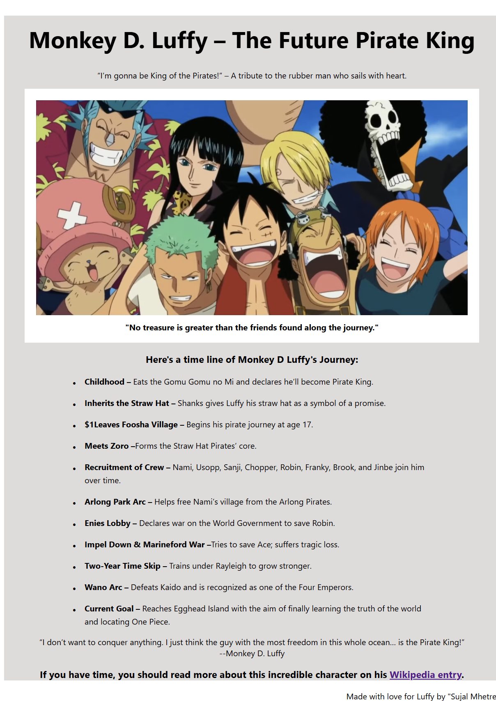

# Tribute Page

This is a **Tribute Page dedicated to Monkey D. Luffy** built using HTML5 and CSS3 as part of the [freeCodeCamp Responsive Web Design Certification](https://www.freecodecamp.org/learn/). The page highlights key milestones from the journey of the future Pirate King.

## 📝 Features

- Responsive design layout  
- Centered content with clean typography  
- Image with caption  
- Timeline with custom bullet points  
- External link to character’s wiki  
- Personalized footer  

## 💡 Purpose

This project was created to practice and demonstrate skills in HTML and CSS. It also fulfills one of the certification project requirements in the **freeCodeCamp Responsive Web Design Course**.

## 🔧 Built With

- HTML5  
- CSS3  

## 📸 Preview

 

## 🚀 Getting Started

To view the project locally:

1. Clone the repository:
   ```bash
   git clone https://github.com/SujalMhetre/Responsive-web-design-projects-.git
   cd Responsive-web-design-projects-/02-tribute-page
