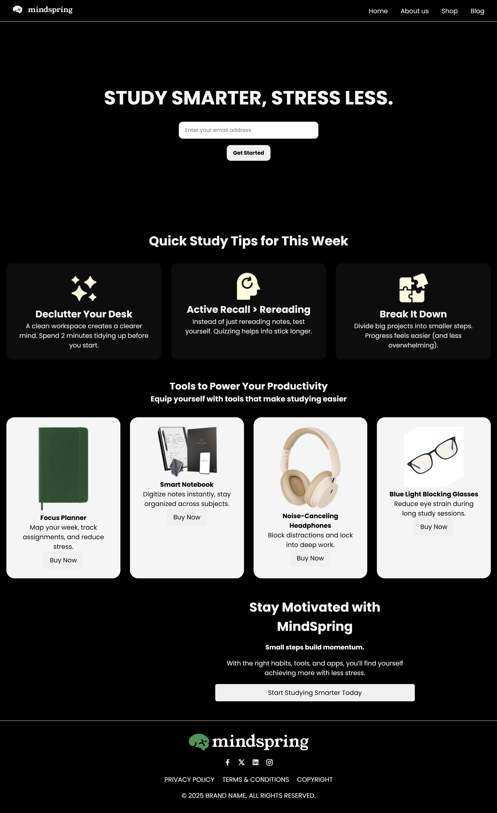

# Product Landing Page

This is a **Product Landing Page** built using HTML5 and CSS3 as part of the [freeCodeCamp Responsive Web Design Certification](https://www.freecodecamp.org/learn/). The form is designed to collect feedback from students about their learning experience and preferences.

## 📝 Features

- Responsive layout for mobile, tablet, and desktop
- Fixed navigation bar with smooth scrolling
- Embedded product video for better engagement
- Feature section highlighting product benefits
- Pricing section with clear options
- Contact form for inquiries
- Styled using modern CSS techniques

## 💡 Purpose

This project was created to practice and demonstrate skills in HTML and CSS. It also fulfills one of the certification project requirements in the **freeCodeCamp Responsive Web Design Course**.

## 🔧 Built With

- HTML5
- CSS3

## 📸 Preview

 

## 🚀 Getting Started

To view the project locally:

1. Clone the repository:
   ```bash
   git clone https://github.com/SujalMhetre/Responsive-web-design-projects-.git
   cd Responsive-web-design-projects/03-Product-Landing-Page
