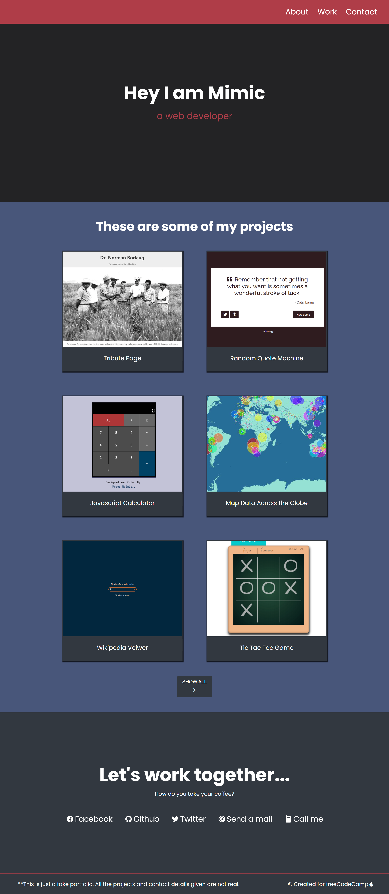

# 🌐 Personal Portfolio Website-2

This is a **Personal Portfolio Website** built using **HTML5** and **CSS3**. It showcases my web development skills, projects, and contact information in a clean, responsive, and interactive layout.

---

## 📝 Features

- ✅ Fully **responsive layout** for desktop, tablet, and mobile devices using **media queries**  
- ✅ **Hero section** with introduction and role  
- ✅ **Projects section** with project cards, images, and hover effects  
- ✅ **Interactive icons** for projects and social links  
- ✅ Fixed **header with navigation links**  
- ✅ **Footer** with portfolio disclaimer and credits  
- ✅ Smooth scrolling to sections  
- ✅ Practiced **mobile-first design and responsive styling**

---

## 💡 Purpose

This project was created to:

- Practice **responsive web design** with media queries  
- Showcase **web development projects** in an interactive portfolio  
- Build a **modern and clean layout** using HTML, CSS, and icon fonts  
- Implement **hover effects and transitions** for better UX

> This project demonstrates a clean, modern portfolio layout and serves as a foundation for future enhancements and real-world portfolio projects.

---

## 🔧 Built With

- **HTML5**  
- **CSS3**  
- **Flexbox & Media Queries**  
- [**Remix Icon Library**](https://remixicon.com/)  
- [**Google Fonts - Poppins**](https://fonts.google.com/specimen/Poppins)

---

## 📸 Preview



---

## 🚀 Getting Started

To view the project locally:

1. Clone the repository:  
   ```bash
    git clone https://github.com/SujalMhetre/Responsive-web-design-projects/Build-2-.git
   cd Responsive-web-design-projects/Build-2
