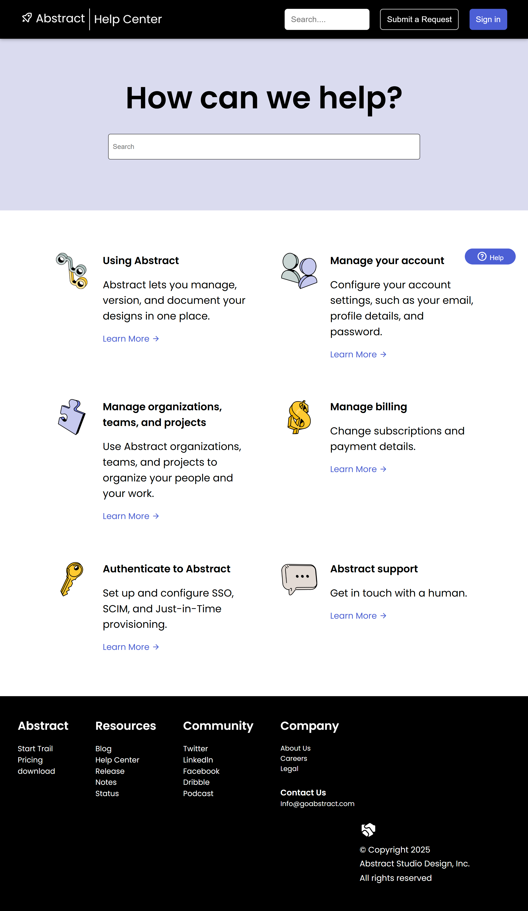

# 🆘 Abstract Help Page (Frontend Practice Clone)

This project is a **responsive clone of the Abstract Help Page**, built as part of my Frontend Practice learning journey. It focuses on building a clean layout, responsive design, and consistent styling using **HTML and CSS**.

---

## 🚀 Features

- ✅ Fully responsive across mobile, tablet, and desktop  
- ✅ Fixed navigation bar with logo and search input  
- ✅ Hero section with centered heading and input field  
- ✅ Service boxes section with icons and text  
- ✅ Footer section with neatly structured information and a floating help button  
- ✅ Built using **pure HTML5 and CSS3 (Flexbox & Media Queries)**  

---

## 🧠 What I Learned

- How to use **Flexbox** for responsive layouts  
- Proper use of **fixed headers** and spacing (`margin-top` adjustments)  
- Responsive design with **media queries for tablets (768–1024px)** and **desktops (1025px+)**  
- Structuring footer layouts and maintaining alignment consistency  
- Button hover effects and UI interaction improvements  

---

## 🛠️ Technologies Used

- **HTML5**
- **CSS3**
- **Google Fonts (Poppins)**
- **Boxicons / Remix Icons**
- **Media Queries**

---

## 📱 Responsive Design

| Device | Layout Type |  
|--------|--------------|  
| Mobile | Stacked layout with simplified content |  
| Tablet | Adjusted paddings, wider inputs, visible buttons |  
| Desktop | Expanded layout, aligned content, and improved spacing |

---

## 📸 Preview




You can check out the original design inspiration here:  
🔗 [Abstract Help Page – Frontend Practice](https://www.frontendpractice.com/projects/abstract)

---

## 🚀 Getting Started

To view the project locally:

1. Clone the repository:  
   ```bash
   git clone https://github.com/SujalMhetre/Responsive-web-design-projects/Build-3-.git
   cd Responsive-web-design-projects/Build-3
